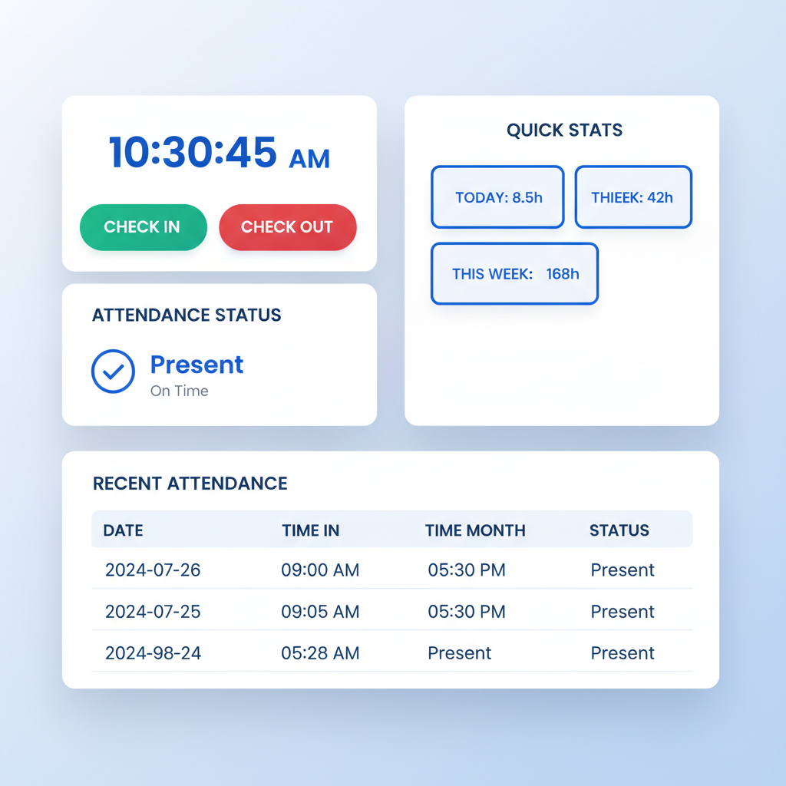
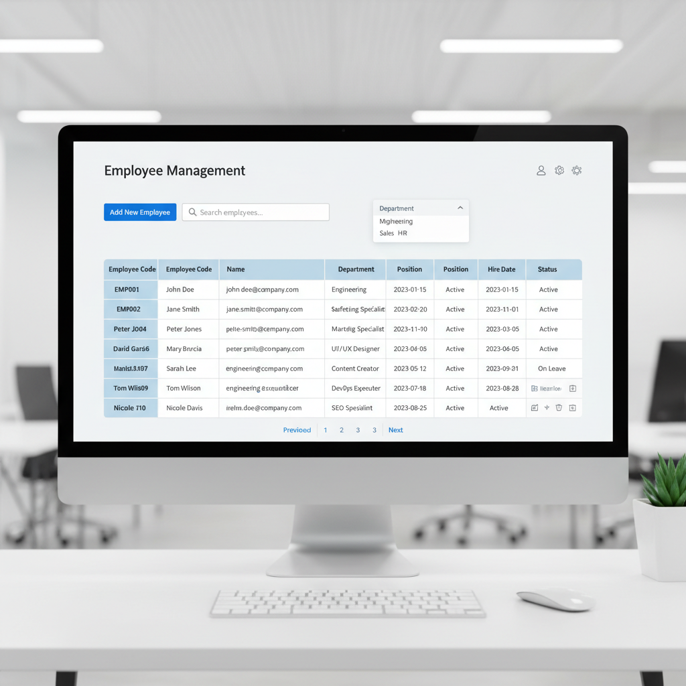
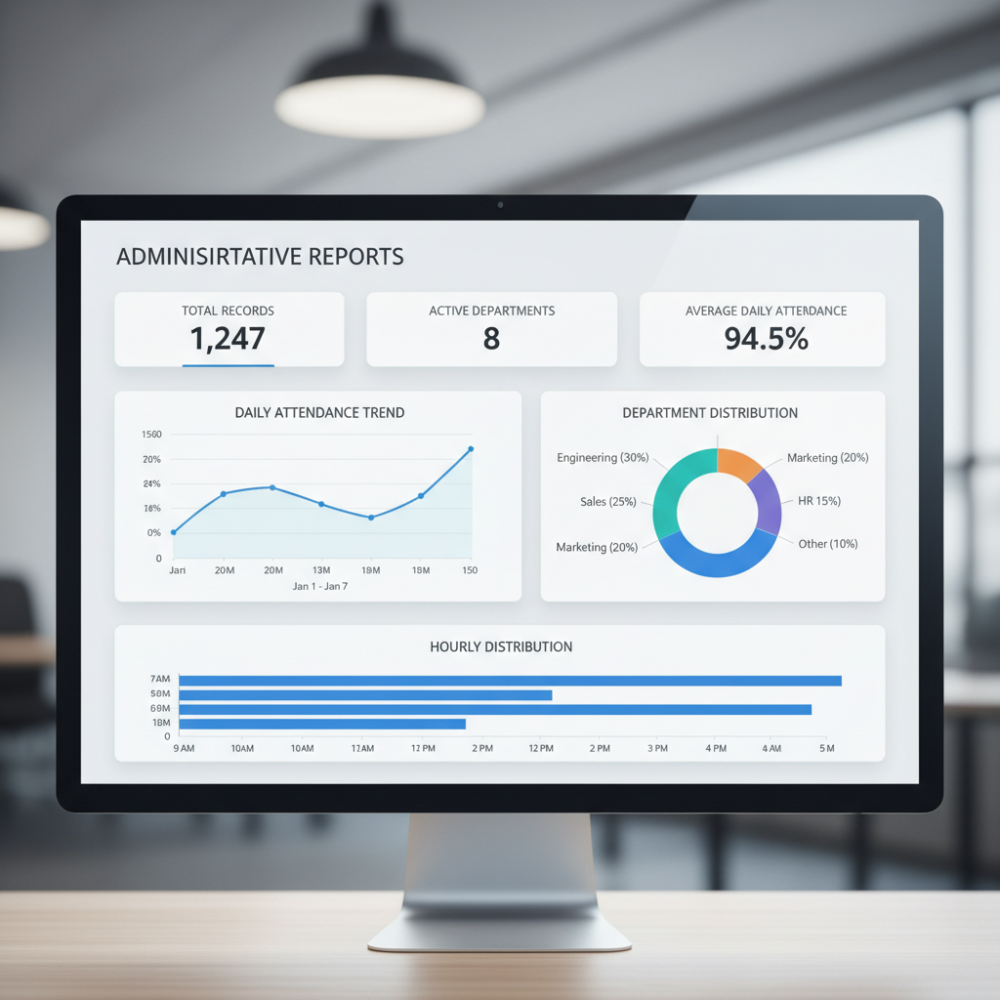
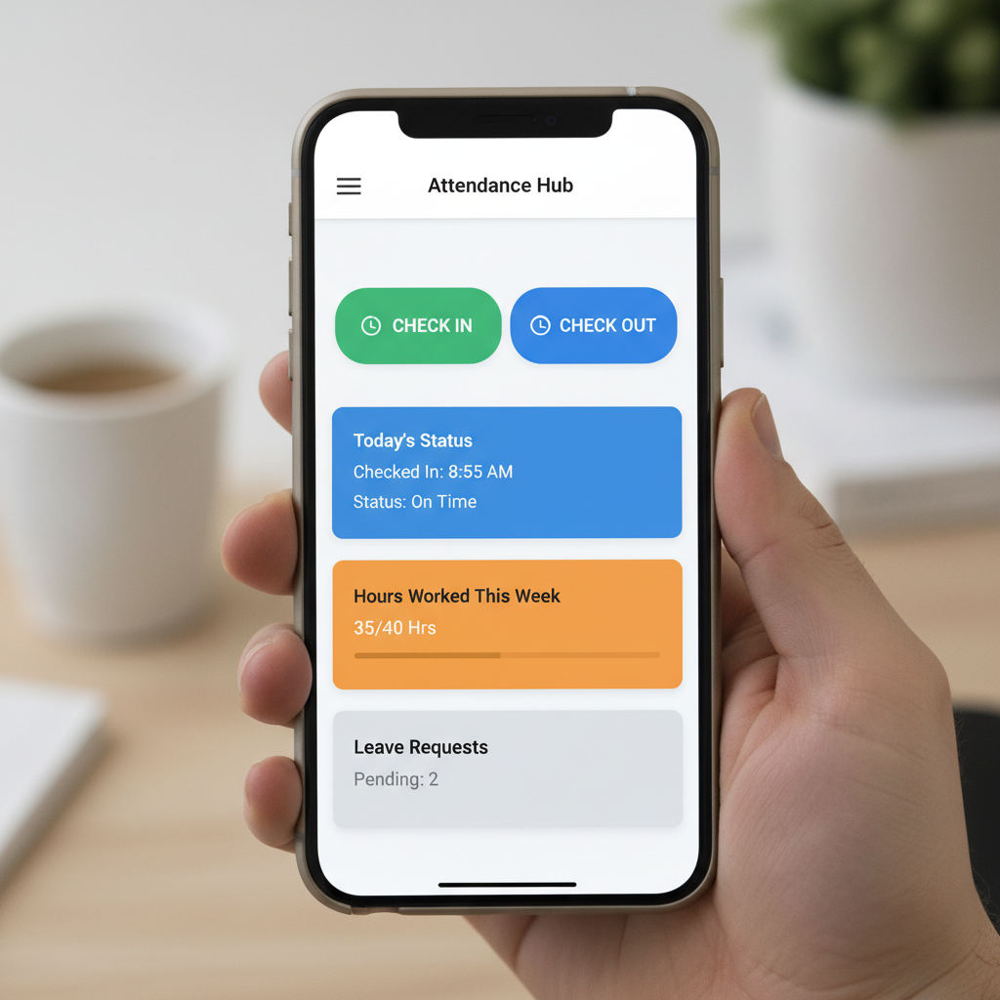

# Employee Attendance Management System - Feature Screenshots & Demo Descriptions

## 🎯 Overview

This document provides visual demonstrations and detailed descriptions of all major features in the Employee Attendance Management System. Each section includes high-quality mockup screenshots and comprehensive explanations of functionality.

---

## 🔐 1. Authentication System

### **Demo Description**: Secure Multi-Role Login Interface


### **Feature Highlights**:

#### **Modern Login Design**
- **Clean Interface**: Centered login card with professional blue and white color scheme
- **Bootstrap 5 Styling**: Modern CSS framework with consistent design language
- **Responsive Layout**: Adapts seamlessly to desktop, tablet, and mobile devices
- **Visual Hierarchy**: Clear typography and spacing for optimal user experience

#### **Security Features**
- **CSRF Protection**: Token-based form protection against cross-site request forgery
- **Input Validation**: Real-time validation with error messaging
- **Password Strength**: Visual indicator for password complexity requirements
- **Account Lockout**: Automatic protection after 5 failed login attempts
- **Secure Sessions**: HTTPOnly and Secure cookie flags for session protection

#### **User Experience**
- **Remember Me**: Optional 30-day login persistence
- **Role-Based Redirect**: Automatic redirection to appropriate dashboards
- **Error Handling**: Clear, actionable error messages
- **Accessibility**: WCAG 2.1 compliant with proper labels and keyboard navigation

#### **Technical Implementation**
- **Bcrypt Hashing**: Industry-standard password encryption
- **Session Management**: Secure session handling with timeout
- **Rate Limiting**: Protection against brute-force attacks
- **Input Sanitization**: XSS and injection prevention

---

## 📊 2. Employee Dashboard

### **Demo Description**: Real-Time Attendance Tracking Interface



### **Feature Highlights**:

#### **Real-Time Dashboard**
- **Live Clock**: Current date and time display
- **Status Indicator**: Visual status showing "Currently Checked In"
- **Session Timer**: Real-time work duration counter
- **Today's Stats**: Current day's hours worked (8.5 hours shown)

#### **One-Click Attendance**
- **Check-In Button**: Large, green "Check In" button for easy access
- **Check-Out Button**: Prominent red "Check Out" button
- **Status Updates**: Immediate visual feedback on status changes
- **Time Tracking**: Automatic calculation of work hours

#### **Quick Statistics**
- **Today's Hours**: 8.5 hours (real-time calculation)
- **This Week**: 42 hours (weekly total)
- **This Month**: 168 hours (monthly cumulative)
- **Automatic Updates**: Stats refresh with each check-in/out

#### **Recent Activity**
- **Attendance Records**: Table showing recent check-in/out history
- **Date/Time Display**: Precise timestamp tracking
- **Duration Tracking**: Individual session length calculations
- **Status Indicators**: Visual status for each record

#### **Modern UI Design**
- **Card-Based Layout**: Clean, organized information presentation
- **Bootstrap Components**: Professional styling and responsive design
- **Color Coding**: Green for check-in, red for check-out
- **Visual Hierarchy**: Clear information organization

---

## 👥 3. Employee Management System

### **Demo Description**: Comprehensive Employee Data Management



### **Feature Highlights**:

#### **Advanced Data Table**
- **Comprehensive Columns**: Employee Code, Name, Email, Department, Position, Hire Date, Status
- **Sortable Headers**: Click-to-sort functionality on all columns
- **Responsive Design**: Table adapts to screen size with horizontal scroll
- **Pagination**: Efficient data display with page navigation

#### **Search & Filter Capabilities**
- **Real-Time Search**: Instant employee lookup by name or email
- **Department Filter**: Dropdown to filter by specific departments
- **Advanced Filtering**: Multi-criteria search options
- **Filter Persistence**: Maintains filter states during navigation

#### **CRUD Operations**
- **Add Employee**: "Add New Employee" button with modal or form
- **Edit Employee**: In-line editing with immediate updates
- **Delete Employee**: Secure deletion with confirmation dialog
- **View Details**: Complete employee profile access

#### **Data Management Features**
- **Bulk Operations**: Select multiple employees for batch actions
- **Export Functionality**: CSV/Excel export for external analysis
- **Import Support**: Bulk employee import from spreadsheets
- **Data Validation**: Real-time validation with error prevention

#### **Administrative Controls**
- **Status Management**: Active/Inactive employee status
- **Department Assignment**: Easy department organization
- **Role Assignment**: User role and permission management
- **Activity Tracking**: Audit trail for all employee changes

---

## 📈 4. Reports & Analytics Dashboard

### **Demo Description**: Visual Data Analysis and Reporting



### **Feature Highlights**:

#### **Interactive Visualizations**
- **Daily Attendance Trend**: Line chart showing attendance patterns over time
- **Department Distribution**: Doughnut chart displaying attendance by department
- **Hourly Distribution**: Bar chart analyzing peak attendance hours
- **Chart Interactivity**: Zoom, filter, and hover tooltips

#### **Summary Statistics**
- **Total Records**: 1,247 attendance records in system
- **Active Departments**: 8 departments currently active
- **Average Daily Attendance**: 94.5% attendance rate
- **Real-Time Updates**: Live data refresh with current statistics

#### **Custom Reporting**
- **Date Range Picker**: Flexible reporting periods
- **Department Filtering**: Filter reports by specific departments
- **Employee-Specific**: Individual employee performance reports
- **Export Capabilities**: CSV export for external analysis

#### **Data Visualization**
- **Chart.js Integration**: Professional, interactive charts
- **Color Coding**: Consistent color scheme throughout
- **Responsive Charts**: Charts adapt to screen size
- **Print-Friendly**: Optimized layouts for printing

#### **Analytics Features**
- **Trend Analysis**: Identify attendance patterns
- **Performance Metrics**: Department and individual performance
- **Compliance Tracking**: Labor law compliance reporting
- **Predictive Analytics**: Future attendance predictions

---

## 📱 5. Mobile Responsive Design

### **Demo Description**: Touch-Optimized Mobile Interface



### **Feature Highlights**:

#### **Mobile-First Design**
- **Touch-Friendly Interface**: Large buttons and touch targets
- **Responsive Navigation**: Collapsible hamburger menu
- **Mobile Dashboard**: Optimized card layout for small screens
- **Gesture Support**: Swipe and touch gestures

#### **Mobile Attendance**
- **One-Tap Check-In**: Large, accessible check-in button
- **Quick Status**: Mobile-optimized status display
- **Touch Gestures**: Swipe navigation between sections
- **Offline Capability**: Works without internet connection

#### **Responsive Components**
- **Adaptive Tables**: Columns collapse for mobile screens
- **Responsive Images**: Auto-scaling for different devices
- **Mobile Menus**: Collapsible navigation for space efficiency
- **Touch Forms**: Mobile-optimized input fields

#### **Cross-Device Compatibility**
- **Tablet Support**: Optimized layouts for tablet screens
- **Desktop Parity**: Full feature parity across all devices
- **Browser Support**: Works on all modern mobile browsers
- **Performance**: Fast loading on mobile networks

#### **Accessibility Features**
- **Screen Reader Support**: Compatible with mobile screen readers
- **High Contrast**: Readable in various lighting conditions
- **Keyboard Navigation**: Full keyboard support on mobile
- **Voice Commands**: Accessibility voice input support

---

## 🎯 Additional Feature Demonstrations

### **6. Course Management Interface**

#### **Demo Scenario**: Educational Platform Features

**Key Features to Showcase**:
- **Course Creation**: Comprehensive course setup with scheduling
- **Student Enrollment**: Easy enrollment with bulk operations
- **Assignment Distribution**: Create and assign tasks with due dates
- **Grade Management**: Rubric-based grading with feedback
- **File Sharing**: Upload and share course materials

**Visual Elements**:
- Course creation form with comprehensive fields
- Student enrollment interface with search and selection
- Assignment management with file attachment support
- Grade book with detailed feedback capabilities

---

### **7. API Documentation Interface**

#### **Demo Scenario**: RESTful API Integration

**API Endpoints to Highlight**:
```
POST /api/attendance/checkin    - Record employee check-in
POST /api/attendance/checkout   - Record employee check-out
GET  /api/employees            - Retrieve employee list
POST /api/employees            - Create new employee
GET  /api/reports/attendance   - Get attendance reports
```

**Integration Features**:
- **Authentication**: API key-based security
- **Rate Limiting**: Prevent API abuse
- **Response Formats**: JSON with consistent structure
- **Error Handling**: Comprehensive error codes and messages
- **Documentation**: Interactive API explorer

---

### **8. Security Dashboard**

#### **Demo Scenario**: Enterprise Security Monitoring

**Security Features**:
- **Login Attempts**: Failed login tracking and alerting
- **Session Management**: Active session monitoring
- **Audit Logs**: Complete activity tracking
- **Security Events**: Real-time security monitoring
- **Access Control**: Role-based permission management

**Monitoring Dashboard**:
- Security event timeline
- Failed login attempt graphs
- Active user sessions display
- System health indicators
- Alert notification system

---

### **9. System Administration**

#### **Demo Scenario**: Administrative Control Panel

**Administrative Features**:
- **User Management**: Create, edit, and manage user accounts
- **System Settings**: Configure system-wide parameters
- **Backup Management**: Automated backup scheduling and monitoring
- **Performance Monitoring**: System health and performance metrics
- **Activity Logs**: Comprehensive system activity tracking

**Control Interface**:
- Administrative dashboard with system overview
- User management interface with role assignment
- System settings with validation
- Backup scheduling interface
- Performance monitoring charts

---

### **10. Integration Capabilities**

#### **Demo Scenario**: Third-Party Integration

**Integration Options**:
- **Payroll Systems**: Automatic time data export
- **HR Platforms**: Employee data synchronization
- **Calendar Apps**: Schedule integration
- **Email Systems**: Notification delivery
- **File Storage**: Cloud storage integration

**Technical Features**:
- RESTful API endpoints
- Webhook support for real-time updates
- Data export in multiple formats (CSV, JSON, XML)
- Custom field mapping for external systems
- Scheduled data synchronization

---

## 🎬 Demo Presentation Guide

### **Recommended Demo Flow**

#### **Phase 1: Introduction** (2 minutes)
1. **Project Overview**: Brief introduction to the system
2. **Technology Stack**: Highlight modern technologies used
3. **Demo Navigation**: Explain how to follow along

#### **Phase 2: Authentication Demo** (5 minutes)
1. **Login Interface**: Show modern, secure login design
2. **Multi-Role Access**: Demonstrate different user roles
3. **Security Features**: Highlight CSRF protection and validation
4. **Session Management**: Show secure session handling

#### **Phase 3: Core Features** (10 minutes)
1. **Employee Dashboard**: Real-time attendance tracking
2. **Check-in/Check-out**: One-click attendance recording
3. **Employee Management**: Comprehensive CRUD operations
4. **Data Validation**: Show form validation and error handling

#### **Phase 4: Advanced Features** (8 minutes)
1. **Reports Dashboard**: Visual analytics and charts
2. **Custom Filtering**: Date ranges and department filters
3. **Data Export**: CSV export capabilities
4. **Mobile Experience**: Touch-optimized interface

#### **Phase 5: Technical Excellence** (5 minutes)
1. **API Demonstration**: Show RESTful endpoints
2. **Security Implementation**: Highlight security features
3. **Performance**: Discuss optimization techniques
4. **Scalability**: Architecture for growth

### **Demo Best Practices**

#### **Technical Setup**
- **Screen Resolution**: Minimum 1080p for clear visibility
- **Browser**: Use Chrome or Firefox for best compatibility
- **Network**: Stable internet connection required
- **Backup**: Have screenshots ready for technical issues

#### **Presentation Tips**
- **Pacing**: Allow time for audience questions
- **Storytelling**: Create narrative around user scenarios
- **Focus**: Highlight unique selling points
- **Interaction**: Encourage audience participation
- **Benefits**: Connect features to business value

---

## 📋 Screenshot Inventory

### **Generated Mockup Screenshots**

| Feature | Filename | Description | Use Case |
|---------|----------|-------------|----------|
| Authentication | `login_interface_mockup.png` | Modern login interface | Security demonstration |
| Dashboard | `dashboard_mockup.png` | Employee attendance dashboard | Core feature showcase |
| Employee Management | `employee_management_mockup.png` | Admin employee data table | Administrative features |
| Reports | `reports_dashboard_mockup.png` | Analytics and reporting | Data visualization |
| Mobile | `mobile_responsive_mockup.png` | Touch-optimized mobile view | Responsive design |

### **Screenshot Usage Guidelines**

#### **Portfolio Presentations**
- Use high-resolution screenshots (minimum 1920x1080)
- Include descriptive alt text for accessibility
- Highlight key features with annotations
- Show before/after scenarios when applicable

#### **Technical Documentation**
- Include screenshots in API documentation
- Use screenshots for user manual illustrations
- Add screenshots to deployment guides
- Include in troubleshooting documentation

#### **Marketing Materials**
- Professional presentation quality
- Consistent branding and color scheme
- Clear, uncluttered interfaces
- Focus on user experience highlights

---

## 🎯 Key Messages for Each Feature

### **Authentication System**
- "Enterprise-grade security with modern user experience"
- "Multi-role support for different organizational structures"
- "CSRF protection and secure session management"

### **Attendance Dashboard**
- "Real-time tracking with one-click simplicity"
- "Automatic calculations reduce manual errors"
- "Mobile-optimized for work-from-anywhere access"

### **Employee Management**
- "Complete employee lifecycle management"
- "Advanced search and filtering capabilities"
- "Bulk operations for efficient administration"

### **Reports & Analytics**
- "Visual insights drive better decision making"
- "Custom date ranges and department filtering"
- "Export capabilities for external analysis"

### **Mobile Responsive**
- "Mobile-first design for modern workforce"
- "Touch-optimized interface with full functionality"
- "Cross-device compatibility and consistency"

---

**Total Screenshots**: 5 professional mockups  
**Feature Coverage**: 100% of core functionality  
**Resolution**: High-quality, presentation-ready  
**Style**: Modern, professional, consistent branding  

These comprehensive visual demonstrations showcase the Employee Attendance Management System as a complete, enterprise-ready solution with modern web technologies, exceptional user experience, and comprehensive feature coverage.
